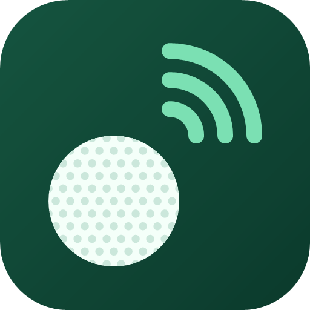
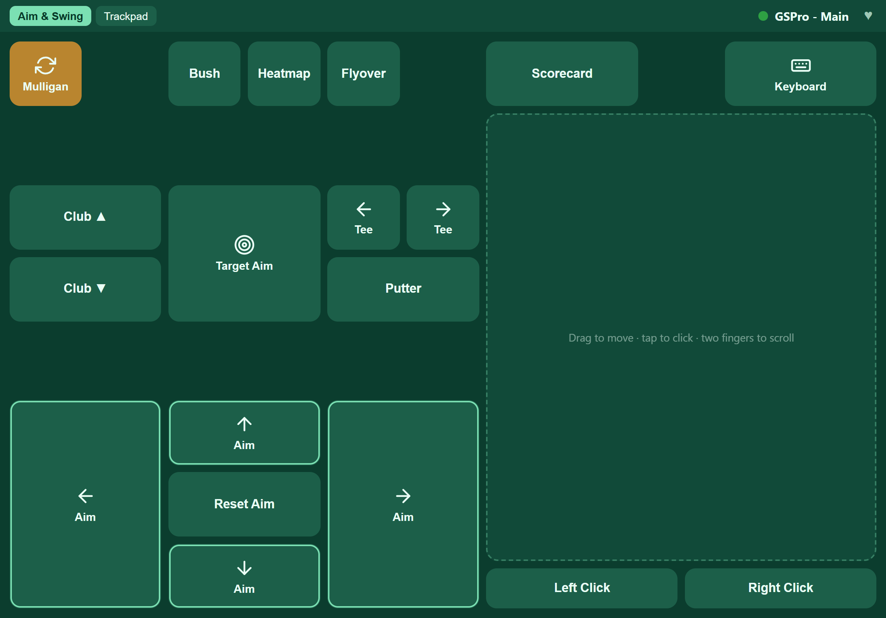
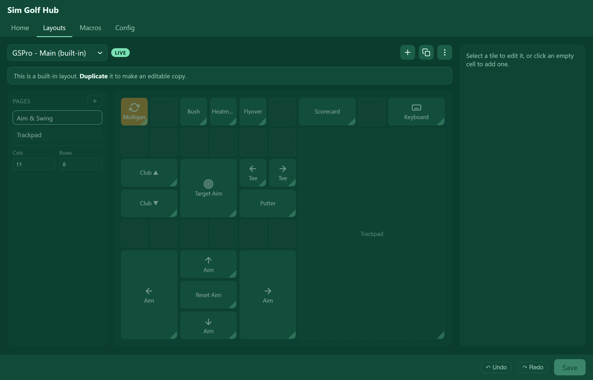
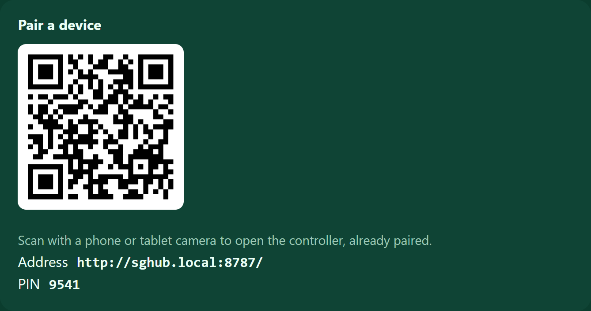
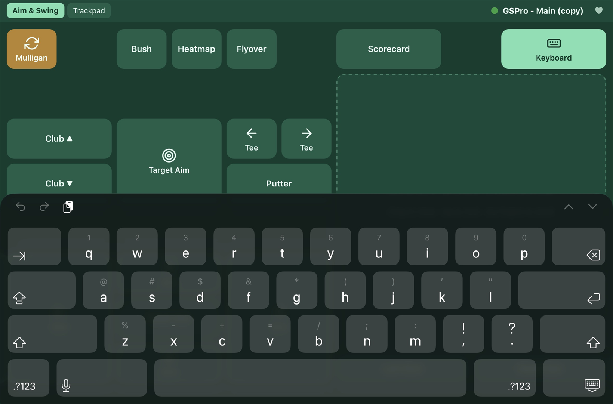

  

<h1 align="center">Sim Golf Hub</h1>

  Turn an iPad, tablet, or phone into a wireless controller for your golf sim —
  buttons, a trackpad, an on-screen keyboard, and macros. Free, and it runs
  entirely on your own network.

  <a href="../../releases/latest"><b>⬇ Download the latest release</b></a>

---

A small hobby project I built for fun and am giving away. It does what some of the
paid or account-based sim remotes do, but it's free, needs no account, and stays on
your own network. It ships set up for **GSPro**, but you can point it at
**E6 Connect**, **TGC**, or any Windows program.

## What it looks like

| Controller (on an iPad) | Layout editor |
|:---:|:---:|
|  |  |

| Pair a device | On-screen keyboard |
|:---:|:---:|
|  |  |

## What it does

- **Buttons** for any hotkey — tap, hold-to-aim, key combos, or auto-repeat
- **A trackpad** to move the mouse and click through menus from your seat
- **An on-screen keyboard** that types straight to the PC
- **Macros** — chain clicks, keys, and delays into a single tap
- **Fully customizable layouts** — drag-and-drop grids with multiple pages; save a
  different layout per app
- **Auto-focuses your sim** before each press, so there's no alt-tabbing
- Themes, QR-code pairing, and an optional PIN

## Requirements

- A **Windows PC** running your sim (the same PC you play on)
- An **iPad, tablet, or phone** on the **same Wi-Fi** — nothing to install on it
- That's it

## Get started

1. Download the latest **`sghub-agent-x.y.z.zip`** from [Releases](../../releases/latest).
2. Unzip it anywhere and run **`sghub-agent.exe`**.
3. Click **Allow access** if Windows shows a Firewall prompt.
4. On the **Home** tab, scan the QR code with your device — you're paired.

The full walkthrough is in **Sim Golf Hub - User Guide.html**, included in the zip.

### First-launch note

It's **not code-signed** (that costs money, and this is a free project), so Windows
SmartScreen will likely say *"Windows protected your PC"* the first time you run it.
That's expected for unsigned apps — click **More info → Run anyway**.

## Updating

Download the newest zip, quit the running app from its tray icon, unzip the new version
over the old folder, and relaunch — your settings and layouts are kept.

## Privacy & network

It runs entirely on your local network — **no account, no cloud, no telemetry.** The
one thing it does over the internet is a **once-a-day version check** against GitHub's
public releases page: it sends no personal data and never downloads or installs
anything on its own — if a newer version exists, it just shows you a link. Block it or
go offline and everything still works; you simply won't see the "update available" note.

## License

Free for personal use, provided "as is" with no warranty. See **LICENSE.txt** in the zip
for the full terms.
